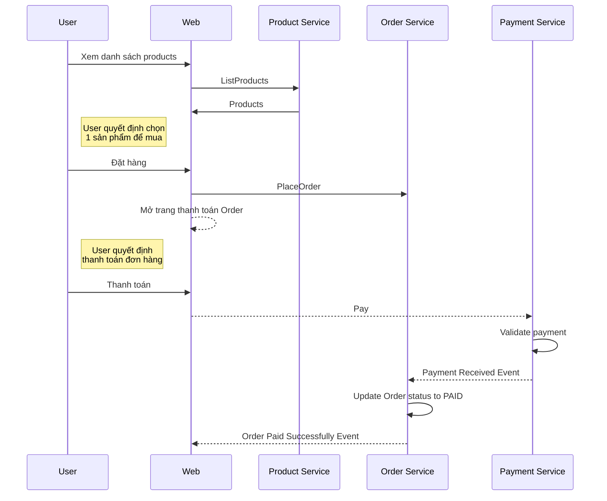

# Micro-services Demo Project
Project chia sẻ cách viết và triển khai 1 dự án sử dụng micro-services kết hợp với mô hình Domain Driven Design. Mục tiêu giúp làm quen với cách tổ chức và tích hợp các thành phần trong kiến trúc micro-services. 

## Kiến trúc triển khai

## Use case (demo)
Business case sử dụng để làm ví dụ:

## Bounded context
Tư duy Bounded context được áp dụng để phân tách các micro-services.

## Công nghệ 
Các công nghệ sử dụng trong project:
 - Backend
	- *Web API*
	- *.NET Core (2.1)*
	- *SQLite*
 - Fontend: *ASP.NET Core MVC (Razor view)*
 - Unit test
	 - *NUnit3*
	 - *Moq*
- CI: *Travis CI*
 - Deployment
	 - *Docker*
	 - *VM*
 - Queuing: *Rabbit MQ*
 - Service Discovery: *Zookeeper*

